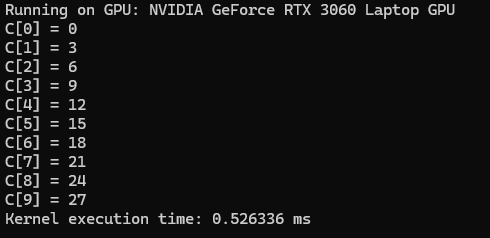

# CUDA_Programming

## Day 1
### File: `kernal.cu`
**Summary:**  
Implemented vector addition by writing a simple CUDA program. Explored how to launch a kernel to perform a parallelized addition of two arrays, where each thread computes the sum of a pair of values.  

**Learned:**  
- Basics of writing a CUDA kernel.
- Understanding of grid, block, and thread hierarchy in CUDA.  
- How to allocate and manage device (GPU) memory using `cudaMalloc`, `cudaMemcpy`, and `cudaFree`.

**output:**
