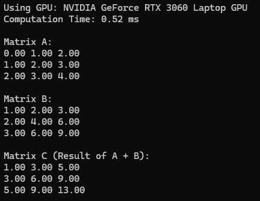

# CUDA_Programming

## Day 1
**Summary:**  
Implemented vector addition by writing a simple CUDA program. Explored how to launch a kernel to perform a parallelized addition of two arrays, where each thread computes the sum of a pair of values.  

**Learned:**  
- Basics of writing a CUDA kernel.
- Understanding of grid, block, and thread hierarchy in CUDA.  
- How to allocate and manage device (GPU) memory using `cudaMalloc`, `cudaMemcpy`, and `cudaFree`.

**output:**

## Day 2
**Summary:**  
Worked on matrix addition using CUDA. Designed the grid and block layout to handle 2D matrices in parallel, with each element processed by an individual thread.  

**Learned:**  
- How to map 2D matrix data onto multiple threads.
- Understanding thread indexing in 2D grids and blocks using `threadIdx`, `blockIdx`, `blockDim`, and `gridDim`.  
- Synchronizing threads and avoiding race conditions when writing results to an output matrix.  

**output:**

